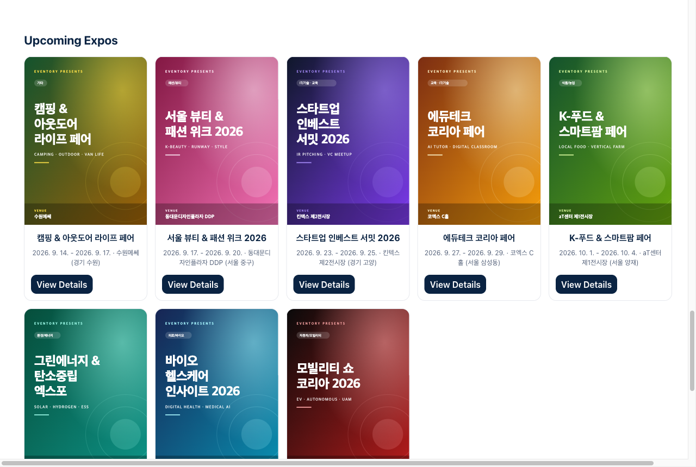
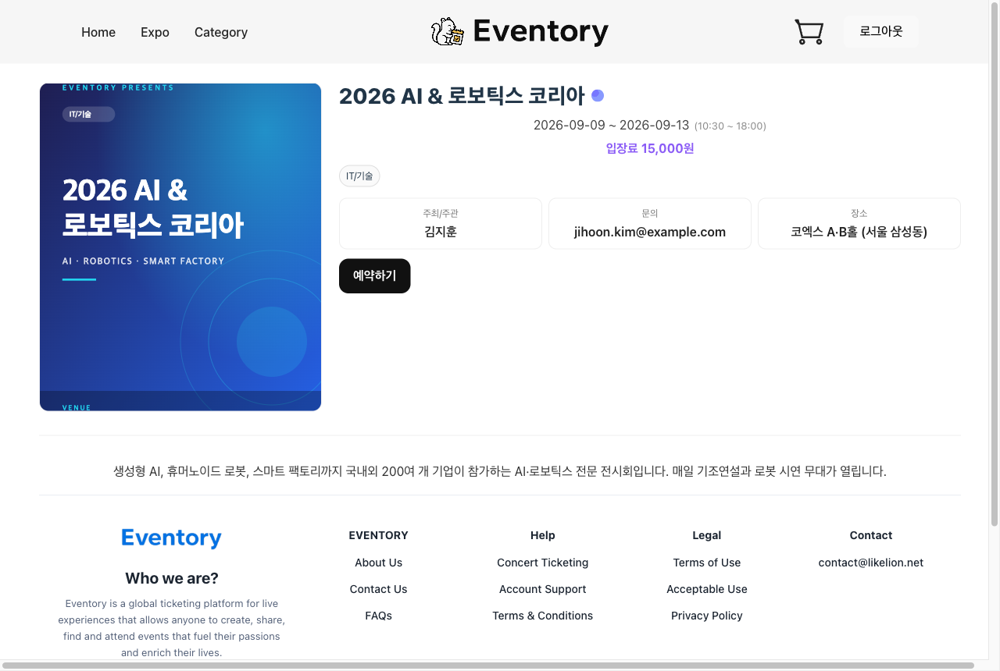
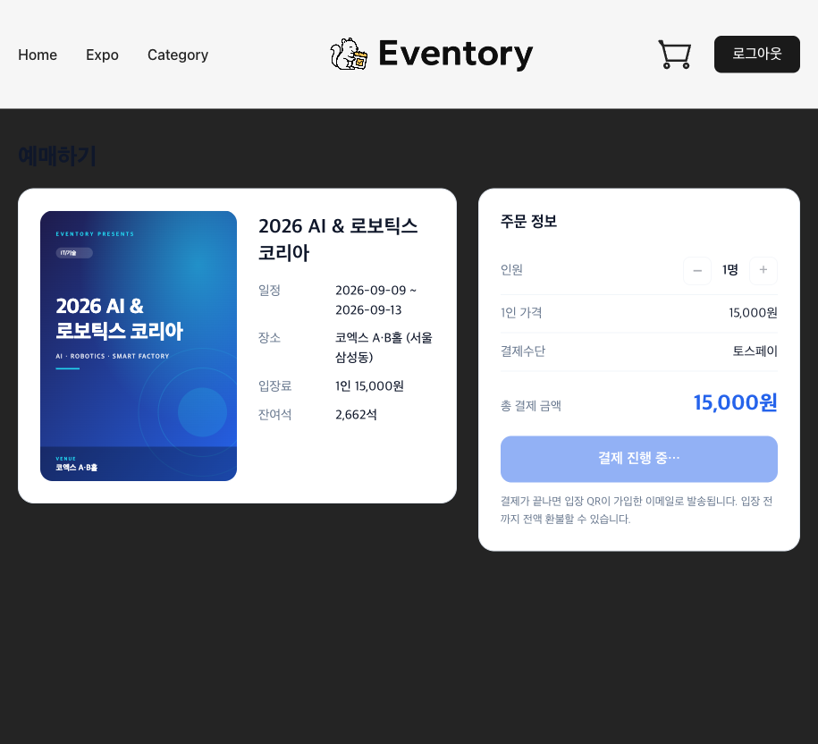
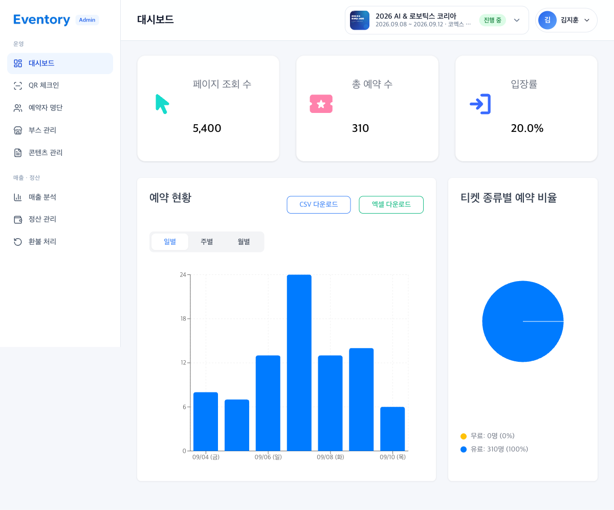
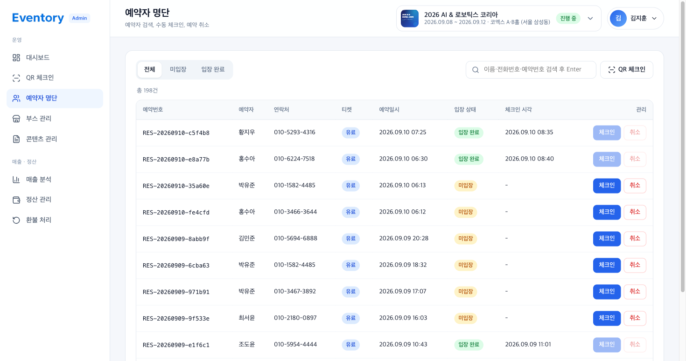
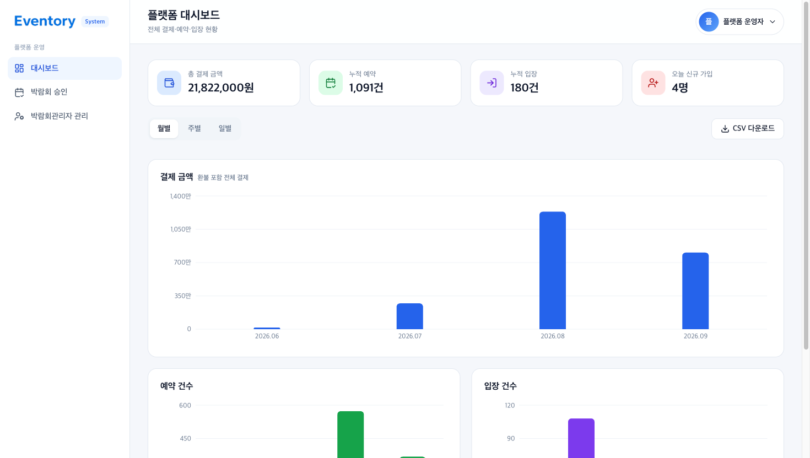
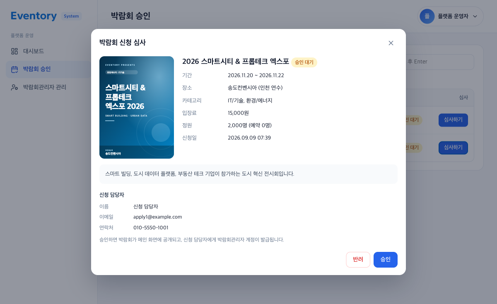
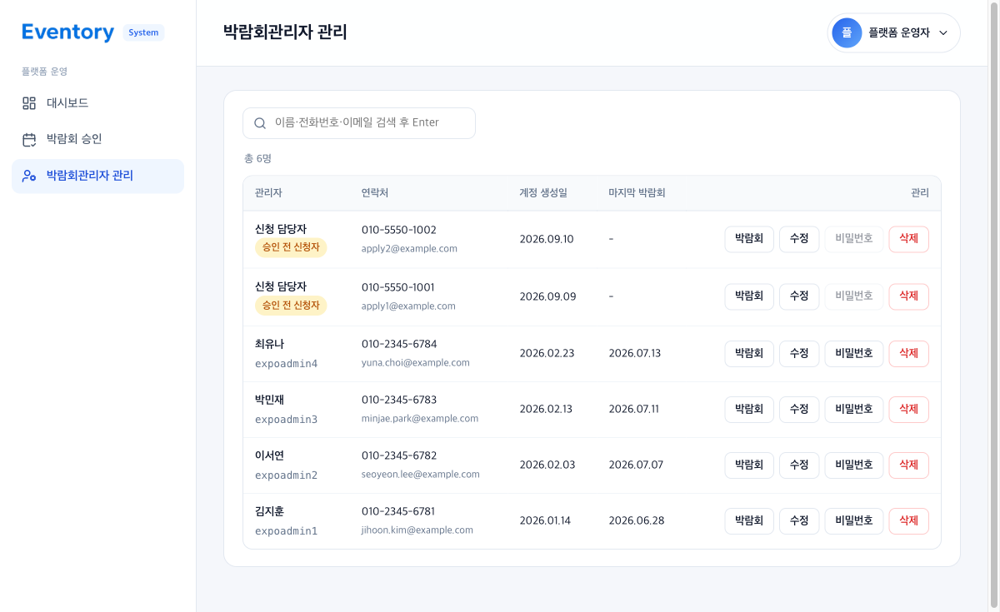
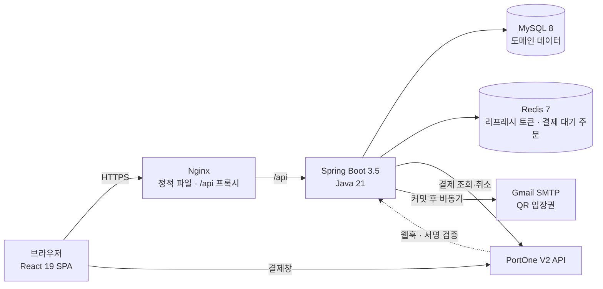
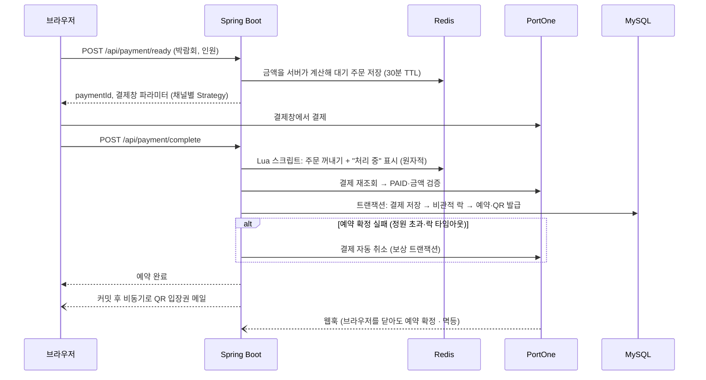

# 🎪 Eventory — 박람회 예약·결제·QR 입장 통합 플랫폼

[](https://github.com/HyungJun-An/Eventory/actions/workflows/ci.yml)


여러 박람회·행사의 **홍보 → 예약 → 결제 → QR 입장 → 정산**을 하나의 플랫폼에서 처리하는 SaaS형 예약 관리 서비스입니다.
시스템관리자·박람회관리자·참가업체·참관객, 네 가지 역할이 각자의 화면과 권한으로 같은 데이터를 다룹니다.

- 행사 운영자의 **업무 효율 향상** (예약자 명단, 현장 QR 체크인, 매출·정산 자동화)
- 참관객의 **예약 경험 개선** (간편결제, 결제 즉시 QR 입장권 메일 발송)
- 플랫폼 운영사의 **행사 호스팅·권한 위임** (박람회 승인 시 박람회관리자 계정 발급)

> **프로젝트 진행 단계**
> | 단계 | 기간 | 브랜치 | 참여 | 내용 |
> |---|---|---|---|---|
> | 1단계 팀 프로젝트 | 2025.07.25 ~ 2025.08.24 | [`main`](https://github.com/HyungJun-An/Eventory/tree/main) | 팀 | 역할별 기능 구현 (PR 87건) |
> | 2단계 개인 리팩터링 | 2026.05 ~ 2026.09 | [`refactor/backend-quality`](https://github.com/HyungJun-An/Eventory/compare/main...refactor/backend-quality) | 안형준 단독 | 보안 취약점 수정, 결제 정합성, 관리자 화면 재작성, 성능 개선, 테스트·CI |
>
> 자세한 구분은 [팀 구성과 기여](#team)를 참고하세요.

---

## 📌 목차

1. [서비스 화면](#screens)
2. [주요 기능](#features)
3. [아키텍처](#architecture)
4. [기술 스택](#tech-stack)
5. [기술적 도전과 해결](#challenges)
6. [실행 방법](#getting-started)
7. [프로젝트 구조](#structure)
8. [문서](#docs)
9. [팀 구성과 기여](#team)
10. [프로젝트 규칙](#rules)

---

<a id="screens"></a>

## 🖥️ 서비스 화면

| 참관객 — 메인 (박람회 목록) | 참관객 — 박람회 상세 |
|:---:|:---:|
|  |  |
| **참관객 — 예매·결제 (토스페이)** | **박람회관리자 — 대시보드** |
|  |  |
| **박람회관리자 — 예약자 명단 (수동 체크인·취소)** | **시스템관리자 — 플랫폼 대시보드** |
|  |  |
| **시스템관리자 — 박람회 신청 심사** | **시스템관리자 — 박람회관리자 관리** |
|  |  |

<sub>화면의 이름·연락처는 데모 데이터로 생성한 가상의 값입니다. 관리자 화면은 2단계에서 다시 만든 화면입니다.</sub>

---

<a id="features"></a>

## ⚙️ 주요 기능

★ 표시는 2단계 개인 리팩터링에서 새로 구현하거나 다시 구현한 기능입니다.

| 역할 | 기능 |
|---|---|
| **참관객** | 박람회 목록·상세, 회원가입·로그인, ★간편결제(PortOne V2 · 채널별 결제 방식 전환), 예매 완료 & ★QR 입장권 메일 발송(커밋 후 비동기), 환불 요청 |
| **참가업체** | 부스 신청·수정, 신청 상태(승인·대기·반려) 확인, 업체 프로필 |
| **박람회관리자** | 대시보드(예약·입장 추이), 예약자 명단(검색 · ★수동 체크인 · ★예약 취소), ★현장 QR 체크인(카메라 스캔·직접 입력), ★부스 심사, 콘텐츠 수정, 매출 분석, 정산 내역 엑셀 다운로드, 환불 승인·반려(★실제 PG 취소 연동) |
| **시스템관리자** | 플랫폼 대시보드(결제·예약·입장 KPI, ★CSV), 박람회 개최 신청 심사(★심사 화면 · ★승인 시 발급 계정 1회 표시), 박람회관리자 계정 관리(정보 수정 · ★임시 비밀번호 재발급) |
| **공통** | ★역할별 리프레시 토큰(권한 상승 차단), ★서버 기동 시 데모 데이터 자동 입력 |

---

<a id="architecture"></a>

## 🏗️ 아키텍처



### 결제 흐름



---

<a id="tech-stack"></a>

## 🧰 기술 스택

| 구분 | 사용 기술 |
|---|---|
| **Backend** | Java 21, Spring Boot 3.5, Spring Security, JPA(Hibernate 6), JJWT, Spring Data Redis, Spring Mail, springdoc-openapi |
| **Frontend** | React 19, Vite 7, React Router 7, axios, recharts, lucide-react, PortOne Browser SDK |
| **Database** | MySQL 8.0, Redis 7 |
| **외부 연동** | PortOne V2 (토스페이·카카오페이·토스페이먼츠·KG이니시스 채널), Gmail SMTP, ZXing(QR), Apache POI·OpenCSV(엑셀·CSV) |
| **Infra** | Docker Compose, Nginx |
| **Test · CI** | JUnit 5, Mockito, Testcontainers(MySQL·Redis), JaCoCo, GitHub Actions |

---

<a id="challenges"></a>

## 🔧 기술적 도전과 해결

2단계 개인 리팩터링에서 해결한 문제들입니다. 원인 분석과 측정 과정은 [`TROUBLESHOOTING.md`](TROUBLESHOOTING.md), 선택 이유·대안·한계는 [`docs/TECH-DECISIONS.md`](docs/TECH-DECISIONS.md)에 정리했습니다.

| 주제 | 문제 | 해결 | 결과 |
|---|---|---|---|
| **동시 예약** | 마지막 자리에 동시 결제 시 정원 초과 | 비관적 락 + `@Version` + 도메인 메서드 | 동시 20건 → 정확히 1건 성공. 낙관적 락만 쓰면 여유석에서도 **18/20 실패** (측정) |
| **락 대기 상한** | JPA 락 타임아웃 힌트가 MySQL에서 무시되어 최대 50초 대기 | 커넥션 초기화 SQL로 `innodb_lock_wait_timeout = 3` | 대기 **6,046ms → 3,031ms**, 초과 시 PG 자동 취소 + 409 |
| **권한 상승** | 참관객 리프레시 토큰으로 **시스템관리자 토큰 발급** | 토큰을 계정 종류와 함께 저장, 재발급 API는 자기 종류만 허용 | 교차 재발급 전부 401, 회귀 테스트 |
| **웹훅** | 서명 검증 없음 + 호출마다 결제 저장 → 서명 없는 요청 3번에 매출 **+45,000원** | HMAC 서명 검증, 재전송 방지, 결제 확정 로직 재사용(멱등) | 위조·재전송 401, 중복 웹훅에도 레코드 증가 없음 |
| **결제 정합성** | 금액을 클라이언트가 결정, 예약 실패 시 돈만 빠져나감 | 서버 금액 계산, Lua 원자 실행, 보상 트랜잭션, 채널별 Strategy | PG사 추가 = 클래스 1개 |
| **N+1** | 목록 API 1회에 SQL 25~34개 | 배치 페치, GROUP BY, DTO 프로젝션, `SUM` 집계 | 쿼리 **34 → 4**, 25 → 6 |
| **번들** | 모든 화면이 JS 785kB 한 파일 | 라우트 단위 `React.lazy`, 벤더 청크 분리 | 메인 첫 JS(gzip) **238.8kB → 105.0kB (−56%)** |
| **테스트** | 테스트 0개 | 위험 영역부터 단위·통합 테스트, CI | **43개**, 실제 MySQL·Redis 컨테이너로 검증 |

---

<a id="getting-started"></a>

## 🚀 실행 방법

### 1. 환경 변수

```bash
cp .env.example .env
# DB_PASSWORD, JWT_SECRET, QR_HMAC_SECRET 등을 채운다 (각 항목에 발급 방법 설명 있음)
# 예) JWT_SECRET=$(openssl rand -base64 48)
```

시크릿은 설정 파일에 두지 않습니다. 필수 값이 비어 있으면 `docker compose`가 기동 전에 오류로 알려 줍니다.

### 2. 전체 스택 기동

```bash
docker compose up -d                      # MySQL · Redis · Spring Boot · Nginx
docker compose logs -f eventory-server    # "Started EventoryApplication" 확인
```

| 서비스 | 주소 |
|---|---|
| 웹 (Nginx) | https://localhost |
| API (Spring Boot) | https://localhost:8080 |
| Swagger UI | https://localhost:8080/swagger-ui/index.html |

처음 기동하면 데모 데이터(박람회 13개, 예약 약 1,000건과 결제·QR·체크인·환불)가 자동으로 들어갑니다.

| 역할 | 아이디 (비밀번호 공통 `Eventory1234!`) |
|---|---|
| 시스템관리자 | `sysadmin` |
| 박람회관리자 | `expoadmin1` ~ `expoadmin4` |
| 참가업체 | `company01` ~ `company08` |
| 참관객 | `user001` ~ `user060` |

### 3. 로컬 개발

```bash
cd eventory-client && npm install && npm run dev   # http://localhost:5173 (/api 는 Vite 프록시)
```

백엔드를 IDE로 실행하면 루트 `.env`를 자동으로 읽습니다.

### 4. 테스트

```bash
cd eventory-server
JAVA_HOME=$(/usr/libexec/java_home -v 21) mvn test   # Docker 필요 (Testcontainers)
# 커버리지 리포트: target/site/jacoco/index.html
```

---

<a id="structure"></a>

## 📁 프로젝트 구조

```
eventory-server/          Spring Boot (도메인별 패키지)
├── auth/                 회원가입·로그인·JWT·리프레시 토큰 (계정 종류별 저장)
├── payment/              결제 준비·확정·환불, 채널 Strategy, 웹훅 서명 검증
├── qr/                   QR 발급·체크인, 입장권 메일
├── expoAdmin/            박람회관리자: 대시보드·예약·매출·정산·부스·콘텐츠
├── expoUser/             참관객: 박람회 목록·상세
├── companyUser/          참가업체: 부스·프로필
├── systemAdmin/          시스템관리자: 박람회 심사·계정 관리·플랫폼 통계
└── common/               엔티티·레포지토리·예외 처리·데모 데이터
eventory-client/          React 19 + Vite
├── expoAdmin/ systemAdmin/   관리자 화면 (공통 레이아웃·adm- 스타일)
├── user/ payment/ companyUser/ auth/
└── api/axiosInstance.js      토큰 자동 첨부·재발급 (역할별 키: auth/tokenKeys.js)
```

---

<a id="docs"></a>

## 📚 문서

- [`TROUBLESHOOTING.md`](TROUBLESHOOTING.md) — 문제 발견 배경 → 근본 원인 → 정량 분석 → 해결 → 선택 근거
- [`docs/TECH-DECISIONS.md`](docs/TECH-DECISIONS.md) — 구현 선택의 이유·대안·한계 (면접 대비 심화)
- [`docs/test-scenarios/`](docs/test-scenarios) — 결제·환불·QR 시나리오 테스트 25개
- API 명세 — 서버 기동 후 Swagger UI

---

## 💡 아이디어 착안

- 각 박람회마다 예약·결제·입장 시스템을 별도로 구축하는 비용과 시간이 큼
  → **공통 플랫폼** 필요
- 모바일웹을 통한 간편 예약이 시장 표준이 되었으나, 소규모/중소 행사들은 여전히 수기 접수(전화/메일/폼) 의존
  → **예약 데이터 분산, 중복, 누락 문제**
- 참가자 확인 및 현장 입장 검수 시 명단 대조에 시간이 많이 걸림
  → **QR 기반 전자 티켓**이 요구됨
- 운영사(전체 관리자)가 여러 박람회를 호스팅하고, 행사진행사(박람회 관리자)에게 개별 권한 위임하는 기능 필요
- 정산, 통계(예약 수, 결제 금액, 참여자 현황) 자동화 요구 증가

---

<a id="team"></a>

## 👥 팀 구성과 기여

### 1단계 — 팀 프로젝트 (2025.07.25 ~ 2025.08.24 · [`main`](https://github.com/HyungJun-An/Eventory/tree/main))

역할(참관객·참가업체·박람회관리자·시스템관리자)별로 기능을 나눠 구현하고, 기능 브랜치 → `dev` → `main` 흐름의 PR 87건으로 협업했습니다.

| <a href="https://github.com/ddolly518"><br/><sub><b>@ddolly518</b></sub></a><br/>강민서 | <a href="https://github.com/dokdokee"><br/><sub><b>@dokdokee</b></sub></a><br/>신드보라 | <a href="https://github.com/yujineeo"><br/><sub><b>@yujineeo</b></sub></a><br/>김유진 | <a href="https://github.com/Seungmi97"><br/><sub><b>@Seungmi97</b></sub></a><br/>황승미 |
|:---:|:---:|:---:|:---:|
| <a href="https://github.com/HyungJun-An"><br/><sub><b>@HyungJun-An</b></sub></a><br/>**안형준** | <a href="https://github.com/gusgo200"><br/><sub><b>@gusgo200</b></sub></a> | <a href="https://github.com/ehayng1"><br/><sub><b>@ehayng1</b></sub></a> | <a href="https://github.com/hyojin0911"><br/><sub><b>@hyojin0911</b></sub></a> |

**안형준 담당 (1단계)**
- **개발 환경·인프라**: Redis 컨테이너·Docker 모니터링 환경 구성, Spring Boot HTTPS 전환, 개발/운영 설정 분기(DB·Vite), Swagger 설정
- **인증 화면**: 로그인 화면, 참관객·참가업체 회원가입 화면과 백엔드 API 연동
- **박람회관리자**: 관리자 사이드바·헤더 레이아웃과 로그아웃 경로, 콘텐츠 관리(백엔드 + 프론트)
- **결제 준비**: PortOne 라이브러리 도입

### 2단계 — 개인 리팩터링 (2026.05 ~ 2026.09 · [`refactor/backend-quality`](https://github.com/HyungJun-An/Eventory/compare/main...refactor/backend-quality))

팀 프로젝트 종료 후 **안형준이 단독으로** 진행했습니다. [기술적 도전과 해결](#challenges)의 모든 항목과 [주요 기능](#features)의 ★ 항목이 이 단계의 작업입니다.

- **보안**: 리프레시 토큰 권한 상승 차단, 시스템관리자 API 인증, 웹훅 서명 검증, 시크릿 `.env` 이전, JWT 필터 버그 수정
- **결제**: 채널별 Strategy 패턴, 서버 금액 계산, Lua 원자 실행, 보상 트랜잭션, 동시 예약 락과 락 대기 상한, 환불 PG 연동
- **화면**: 박람회관리자·시스템관리자 화면 재작성, 역할별 토큰 키 단일화, 라우트 단위 코드 분할
- **성능·품질**: N+1 제거, 테스트 43개(Testcontainers), GitHub Actions CI, 데모 데이터 자동 입력
- **문서**: README, [`TROUBLESHOOTING.md`](TROUBLESHOOTING.md), [`docs/TECH-DECISIONS.md`](docs/TECH-DECISIONS.md)

---

<a id="rules"></a>

## 📑 프로젝트 규칙 (1단계 팀 규칙)

### Branch Strategy
> - main / dev 브랜치 기본 생성
> - main과 dev로 직접 push 제한
> - PR 전 최소 1인 이상 승인 필수

### Git Convention
> 1. 적절한 커밋 접두사 작성
> 2. 커밋 메시지 내용 작성
> 3. 내용 뒤에 이슈 (#이슈 번호)와 같이 작성하여 이슈 연결

> | 접두사        | 설명                           |
> | ------------- | ------------------------------ |
> | Feat :     | 새로운 기능 구현               |
> | Add :      | 에셋 파일 추가                 |
> | Fix :      | 버그 수정                      |
> | Docs :     | 문서 추가 및 수정              |
> | Style :    | 스타일링 작업                  |
> | Refactor : | 코드 리팩토링 (동작 변경 없음) |
> | Test :     | 테스트                         |
> | Deploy :   | 배포                           |
> | Conf :     | 빌드, 환경 설정                |
> | Chore :    | 기타 작업                      |


### Pull Request
> ### Title
> * 제목은 '[Feat] 홈 페이지 구현'과 같이 작성합니다.

> ### PR Type
> - [ ] FEAT: 새로운 기능 구현
> - [ ] ADD : 에셋 파일 추가
> - [ ] FIX: 버그 수정
> - [ ] DOCS: 문서 추가 및 수정
> - [ ] STYLE: 포맷팅 변경
> - [ ] REFACTOR: 코드 리팩토링
> - [ ] TEST: 테스트 관련
> - [ ] DEPLOY: 배포 관련
> - [ ] CONF: 빌드, 환경 설정
> - [ ] CHORE: 기타 작업

> ### Description
> * 구체적인 작업 내용을 작성해주세요.
> * 이미지를 별도로 첨부하면 더 좋습니다 👍

> ### Discussion
> * 추후 논의할 점에 대해 작성해주세요.

### Code Convention
>BE
> - 패키지명 전체 소문자
> - 클래스명, 인터페이스명 CamelCase
> - 클래스 이름 명사 사용
> - 상수명 SNAKE_CASE
> - Controller, Service, Dto, Repository, mapper 앞에 접미사로 통일(ex. MemberController)
> - service 계층 메서드명 create, update, find, delete로 CRUD 통일(ex. createMember)
> - Test 클래스는 접미사로 Test 사용(ex. memberFindTest)


> FE
> - styled-Component 변수명 S + 변수명 (ex. Swrap)
> - styled-Component는 return문 위에 작성
> - 크게는 styled-Component, 그 안에서 className 사용
> - Event handler 사용 (ex. handle ~)
> - export방식 (ex. export default ~)
> - 화살표 함수 사용

### Communication Rules
> - Discord 활용
